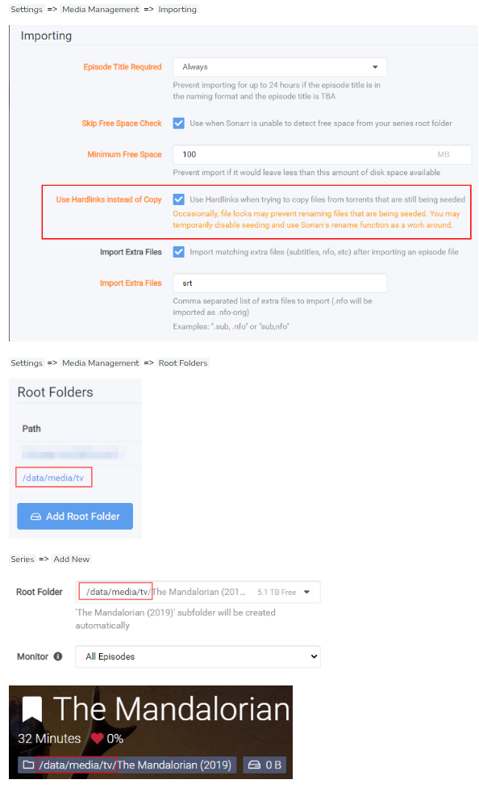
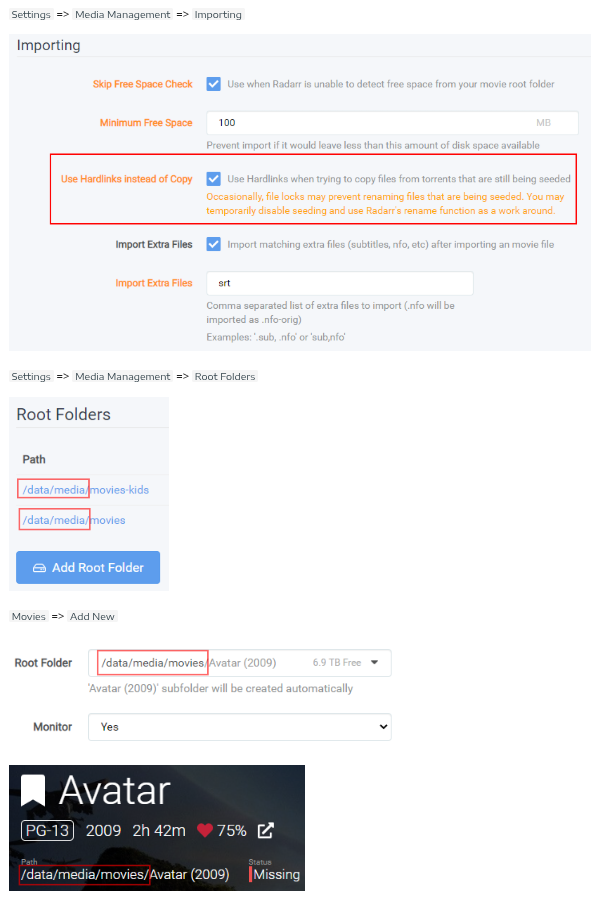
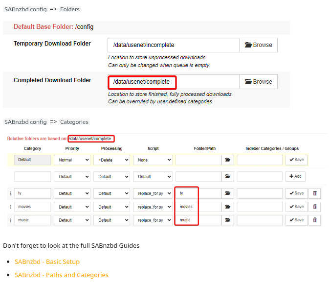

# Starr Apps Setup

## Folder Structure
I have followed this guide: https://trash-guides.info/File-and-Folder-Structure/Examples/ 

You will need to create a folder structure like this for the apps. You can set the base directory of the data folder to wherever you want. 

The `init_folders.sh` script will set this up as expected.

```
data
├── torrents
│   ├── books
│   ├── movies
│   ├── music
│   └── tv
├── usenet
│   ├── incomplete
│   └── complete
│       ├── books
│       ├── movies
│       ├── music
│       └── tv
└── media
    ├── books
    ├── movies
    ├── music
    └── tv
```

## Sonarr Config
The correct setup for Sonarr given the folder structure that has been set up is:



## Radarr Config
The correct setup for Radarr given the folder structure that has been set up is:



## Sabnzbd Config
The correct setup for Radarr given the folder structure that has been set up is:



# Further detailed setup

https://trash-guides.info/Downloaders/SABnzbd/Basic-Setup/

## General connection setup

SABnzbd needs connection to:
* Usenet server

Prowlarr needs connection to:
* Indexer services
* Sonar
* Radarr

Radarr needs connection to:
* SABnzbd

Sonarr needs connection to:
* SABnzbd

Bazarr needs connection to:
* Sonar
* Radarr
* Maybe an extra subtitle service??

## Fine tuning of Sonarr
https://trash-guides.info/Sonarr

## Fine tuning of Radarr
https://trash-guides.info/Radarr/

## Fine tuning Bazarr
https://trash-guides.info/Bazarr/